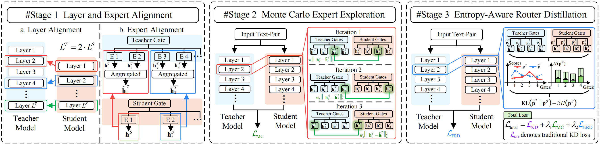

# B-Distill

The codes for our paper **Balanced Knowledge Distillation for Large Language Models with Mix-of-Experts**.

## 📖 Overview

This repository contains the official implementation of **B-Distill**, which is a *moe-to-moe* distillation framework for LLMs.

## 🏗️ Framework



## 📁 Project Structure

```
B-Distill/
├── 📂 checkpoints/             # Pre-trained model checkpoints
├── 📂 data.zip/                    # Dataset files
│   ├── alpacmygavel
│   ├── dolly
│   ├── GenMedGPT
│   ├── self-inst
│   ├── uinst
│   ├── us_terms
│   └── vicuna
├── 📂 images/                  # Pictures in readme
├── 📂 outputs/                 # saved model checkpoints  
├── 📂 peft/                    # lightweight training packages, with the implementation of moe
├── 📂 scripts/                 # training scripts
├── 📂 src/                     # Source code
│   ├── distillation_trainer.py # trainer for distillation
│   └── losses.py               # distillation losses
├── build_dataset.py            # dataset scripts
├── moe-distill.py              # distill scripts
├── eval_rouge_l.py             # evaluate scripts
├── requirements.txt            # Dependencies
└── README.md                   # This file
```

## 🔧 Requirements

### Hardware

- 8 * NVIDIA A100 GPUs (or equivalent)implementation

### Software

- Python 3.12
- PyTorch >= 1.13.1
- CUDA-compatible GPU drivers

## ⚡ Quick Start

### 1. Installation

Install dependencies:

```bash
pip install -r requirements.txt
```

### 2. Data and Model Preparation

Extract the provided datasets:

```bash
unzip data.zip
```

Download the next models in the **checkpoints** folder:

```
llama-3.1-8b
llama-3.2-1b
qwen3-4b
qwen3-0.6b
```

### 3. Training the teacher model

Train the teacher model on Dolly:

```bash
chmod 777 -R ./
./scripts/fine-tuning-llama3-8b.sh
./scripts/fine-tuning-qwen3-4b.sh
```

### 4. Training the student model (SFT)

Train the student model on Dolly:

```
./scripts/fine-tuning-llama3-1b.sh
./scripts/fine-tuning-qwen0.6b.sh
```

### 5. Distill the student model with B-Distill

Run the next scripts for our B-Distill:

```bash
./scripts/run_expert_distill_llama3_1b.sh
./scripts/run_expert_distill_qwen3.sh
```

### 6. Evaluation

Run the next scripts for evalutaion:

```bash
./scripts/eval_llama3.sh
./scripts/eval_qwen3.sh
```


### 7. Ablation experiments

Remove the **Monte Carlo Expert Exploration**:

```
./scripts/ablation_methoda_llama3.sh
./scripts/ablation_methoda_qwen3.sh
```

Remove the **Entropy-Aware Router Distillation**:

```
./scripts/ablation_methodb_llama3.sh
./scripts/ablation_methodb_qwen3.sh
```

##  😀 License

This project is licensed under the MIT License.

## 🙏 Acknowledgments

We thank the authors of the baseline methods and dataset providers for making their code and data available.
